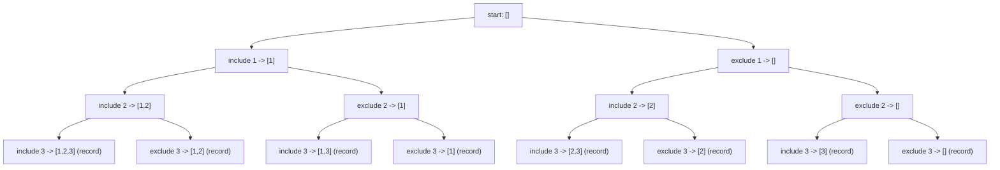

Here’s the **approach to generate all subsets (power set) using recursion** in **Java**, along with the reasoning behind it:

---

## **Approach to Generate All Subsets**

The task is to generate the **power set** of a given set (all possible subsets, including the empty set and the full set).
We use **recursion with backtracking** to explore two possibilities for each element:

* **Include the element** in the current subset.
* **Exclude the element** from the current subset.

---

### **Steps**

1. **Start with an empty subset**.
2. At each index `i` of the array:

   * Make one recursive call **including** the element `arr[i]` in the current subset.
   * Make another recursive call **excluding** the element `arr[i]`.
3. When the index reaches the end of the array (`index == arr.length`), **record the current subset**.
4. Use **backtracking** to remove the last element after exploring the "include" path.

---

### **Key Points**

* **Time Complexity:** `O(2^n)` because for each element, there are two choices (include or exclude).
* **Space Complexity:** `O(n)` for the recursion stack and temporary subset storage.

---

### **Java Code**

```java
import java.util.*;

public class Subsets {
    public static void main(String[] args) {
        int[] nums = {1, 2, 3};
        List<List<Integer>> result = new ArrayList<>();
        generateSubsets(nums, 0, new ArrayList<>(), result);

        System.out.println("All Subsets:");
        for (List<Integer> subset : result) {
            System.out.println(subset);
        }
    }

    private static void generateSubsets(int[] nums, int index, List<Integer> current, List<List<Integer>> result) {
        if (index == nums.length) {
            result.add(new ArrayList<>(current)); // Add the current subset
            return;
        }

        // 1. Include nums[index]
        current.add(nums[index]);
        generateSubsets(nums, index + 1, current, result);

        // 2. Exclude nums[index] (backtrack)
        current.remove(current.size() - 1);
        generateSubsets(nums, index + 1, current, result);
    }
}
```

---

### **Dry Run Example**

For `nums = [1, 2, 3]`:

* Start with `[]`.
* Include `1` → explore `[1, ...]`.
* Include `2` → explore `[1, 2, ...]`.
* Include `3` → `[1, 2, 3]` → record.
* Exclude `3` → `[1, 2]` → record.
* Backtrack and explore other possibilities.

---

### **Mermaid Recursion Tree**

You can paste this into `README.md`:



---

### **Output for `[1,2,3]`**

```
[]
[3]
[2]
[2, 3]
[1]
[1, 3]
[1, 2]
[1, 2, 3]
```


## Recursion Tree for Subset Generation

```mermaid
graph TD
    A0["subset([], index=0)"]
    A1["include arr[0] -> subset([1], index=1)"]
    A2["include arr[1] -> subset([1,2], index=2) -> print [1,2]"]
    A3["exclude arr[1] -> subset([1], index=2) -> print [1]"]
    B1["exclude arr[0] -> subset([], index=1)"]
    B2["include arr[1] -> subset([2], index=2) -> print [2]"]
    B3["exclude arr[1] -> subset([], index=2) -> print []"]

    A0 --> A1 --> A2
    A1 --> A3
    A0 --> B1 --> B2
    B1 --> B3
